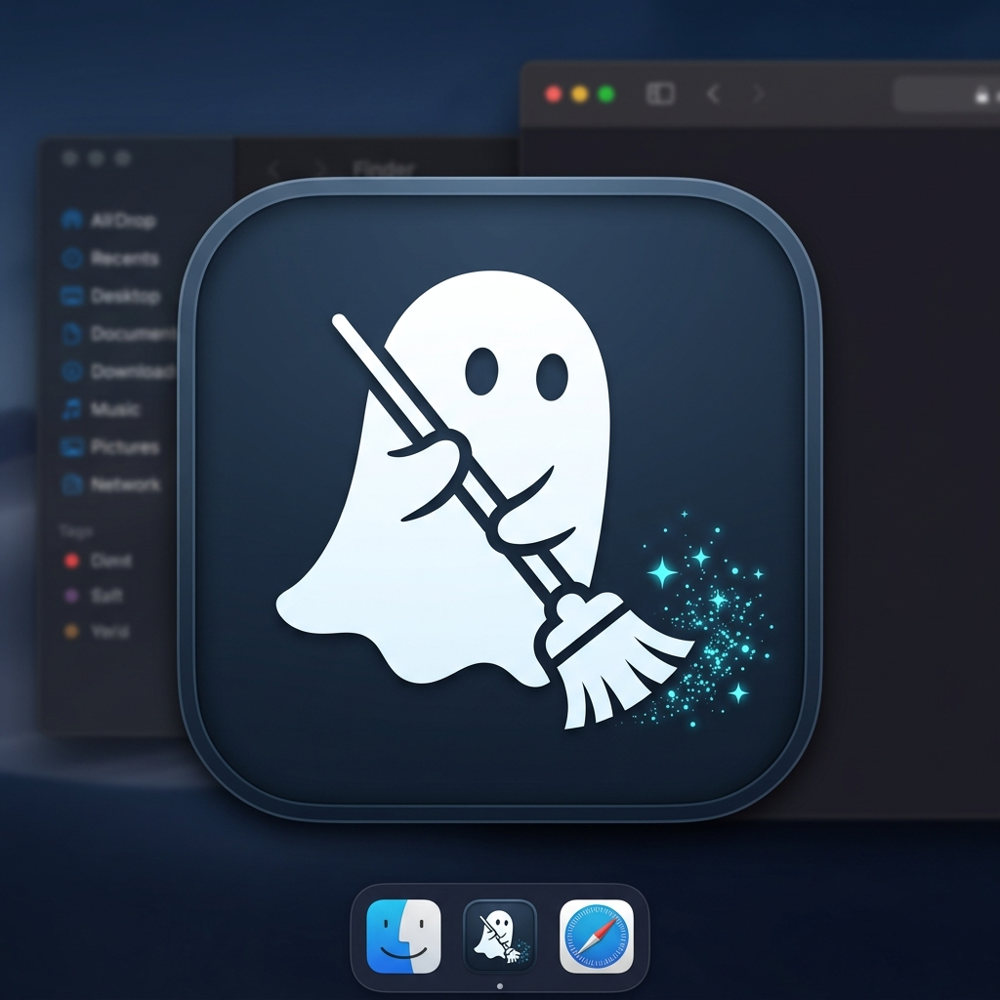

<p align="center">
  
</p>

# GhostSweep

> Native macOS application and CLI tool that cleans and permanently prevents hidden residue files (.DS_Store, AppleDouble ._*, .Spotlight-V100, .Trashes, Windows/Linux metadata) on external drives. Built with Swift and SwiftUI with zero third-party dependencies.

[Download Latest Release (v1.0.0)](https://github.com/r0bledas/GhostSweep/releases/latest) • [All Releases](https://github.com/r0bledas/GhostSweep/releases)

---

## Features

- **Drive Immunization**: Places hardware-level prevention markers directly on external volumes:
  - `.metadata_never_index`: Instructs macOS Spotlight to permanently skip indexing the volume.
  - `.fseventsd/no_log`: Disables filesystem event transaction logging.
  - Neutralized `.Trashes`: Locks the trash location as an immutable file (`chflags uchg`) so Finder permanently deletes files without creating a hidden trash directory.
  - **Protection Guard**: Clean operations never flag or remove active immunization markers.
- **Active Real-Time Sentry**: Background `FSEventStream` monitor that intercepts newly created `.DS_Store` and AppleDouble (`._*`) files in milliseconds and removes them immediately.
- **System-Wide macOS Shield**: Configures `com.apple.desktopservices DSDontWriteUSBStores` so Finder does not generate `.DS_Store` files on USB drives or network volumes.
- **System Debris Sweeper**: Detects and purges existing `.DS_Store`, AppleDouble (`._*`), `.Spotlight-V100`, and `.TemporaryItems` directories.
- **Cross-Platform Sanitizer**: Cleans Windows and Linux metadata files (`Thumbs.db`, `desktop.ini`, `$RECYCLE.BIN`, `.directory`).
- **Developer Artifacts (Optional)**: Can clean `node_modules`, `.git`, `.cache`, `target`, `.build`, and `__pycache__` when copying code repositories to external drives.
- **Auto-Clean on Finder Eject**: Optional background watcher that sweeps external drives automatically whenever they are unmounted via Finder.
- **Interactive Checklist**: Review and selectively toggle individual files or entire categories before deletion.
- **Safety Guardrails**: Strictly whitelists external and removable media while protecting internal system partitions (Macintosh HD, `/System`, `/usr`, `/bin`) against accidental selection.
- **POSIX Directory Walker**: Uses Darwin POSIX kernel-level directory enumeration to catch hidden AppleDouble `._*` files that standard Cocoa APIs mask.

---

## Installation and Setup

### Prerequisites

- macOS 14.0 (Sonoma) or newer
- Xcode 15+ or Swift 5.9+ command line tools

### Clone and Build

Clone the repository and change directory into the project root:

```bash
git clone https://github.com/r0bledas/GhostSweep.git
cd GhostSweep
```

Build the application bundle and CLI binary:

```bash
make build
```

Run the GUI app:

```bash
make run
```

Or open directly in Xcode:

```bash
open Package.swift
```

---

## CLI Usage (ghostsweep)

The command-line binary is located at `.build/release/ghostsweep` after building:

```bash
# List mounted external drives
.build/release/ghostsweep list

# Scan a drive or directory for residue files
.build/release/ghostsweep scan /Volumes/MyUSB

# Clean residue files from a drive
.build/release/ghostsweep clean /Volumes/MyUSB --yes

# Immunize a drive against Spotlight, Trashes, and FSEvents
.build/release/ghostsweep immunize /Volumes/MyUSB

# Clean including developer dependencies (node_modules, .git)
.build/release/ghostsweep clean /Volumes/MyUSB --all --yes

# Run real-time background sentry on a mount point
.build/release/ghostsweep watch /Volumes/MyUSB

# Check or apply system-wide USB .DS_Store prevention
.build/release/ghostsweep shield --apply
```

Optional: Install the CLI tool system-wide:

```bash
sudo cp .build/release/ghostsweep /usr/local/bin/
```

---

## Permissions Note

Apple protects Spotlight metadata directories (`.Spotlight-V100`) via kernel sandbox policies (`kTCCServiceSystemPolicyAllFiles`). To allow GhostSweep to remove existing `.Spotlight-V100` directories:

1. Open **System Settings > Privacy & Security > Full Disk Access**.
2. Add **GhostSweep.app** (or your terminal application) to the list and enable access.
3. If Full Disk Access is not granted, GhostSweep will notify you and continue cleaning all non-restricted residue files.

---

## Architecture

- **`GhostSweepCore`**: Shared Swift library containing volume management, POSIX directory scanning, immunization services, and FSEvents sentry logic.
- **`GhostSweepApp`**: Native SwiftUI application with Menu Bar Extra, volume status gauges, copyable file paths, and selective sweep checklists.
- **`GhostSweepCLI`**: Lightweight standalone terminal interface.

---

## Testing

Run the test suite from the repository root:

```bash
cd GhostSweep
make test
```

Or run directly via Swift Package Manager:

```bash
swift test
```
